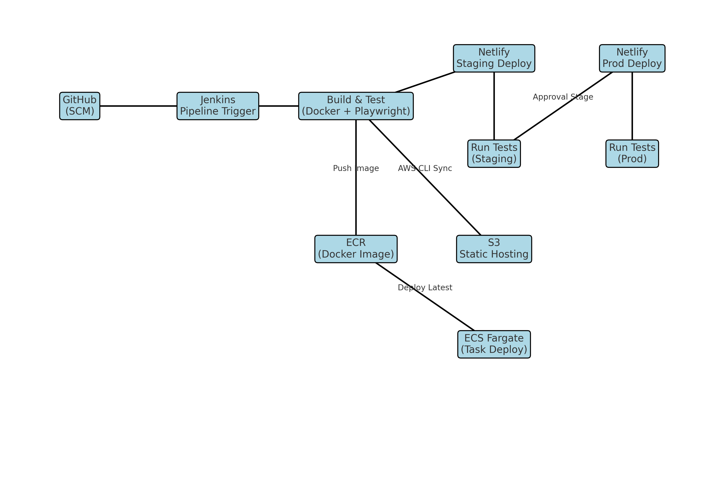

created E2E jenkins flow

1. Netlify deploy
-> downloaded a simple node web app
-> uses github for scm polling and setup cron for automatic build after there is a new push 
-> uses a docker image to install package, create build run tests
-> install serve on the same image and run the app locally and tested using playwright 
-> hosted on netlify --> stage deploy -> run test on staginbg server           ->can add approval stage in pipeline
                    --> prode deploy -> run test on prod server
-> Later combined all the required dependencies to run whole pipeline in a single image and scheduled a cron to run in the night and uses that image for dev.

2.integration with AWS
2.1 Hosted on S3 as static website
    -> use awscli image
    -> created jenkins user and access key 
    -> created s3 bucket 
    -> configured jenkins for that user (stored the token in jenkins)
    -> sync build with s3 bucket through AWS cli

2.2 created an image for of whole application and pushed on ECR
    -> created a custom awscli image to run docker
    -> created repo on ECR
    -> created an image FROM nginx and copied build
    -> pushed on ECR
    -> created a fargate cluster and task definiation using latest application image created above 
    -> register a new task def version
    -> update cluter service with new task version
    -> wait untill the service is updated and tasks are running.

Version controlling using $BUILD_ID of jenkins pipeline number
parsing using jq for intermediate steps
to increase efficiency of development cycle -> using saperate pipeline for custom image creation and installing additional dependencies.
                                            -> running these pipelines in off-peak hours (using scheduled cron jobs)

